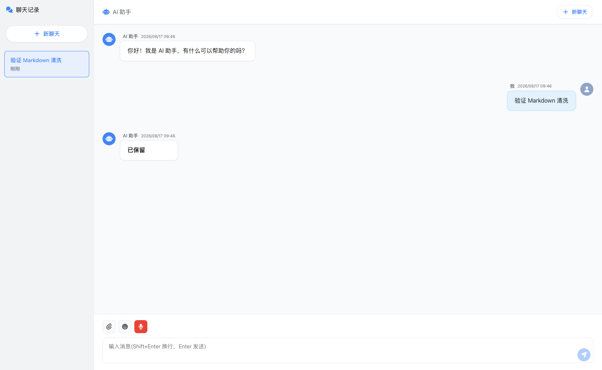

# AIChat

面向移动端的 AI 聊天应用。前端使用 Vue 3 + TypeScript，后端使用 ASP.NET Core 10、SQLite 和 OpenAI 兼容模型接口，支持流式回复、会话历史、图片/文档附件与语音输入输出。

## 运行效果



## 目录

- `DotnetApi/`：ASP.NET Core API、SQLite 迁移和文件处理服务。
- `Vue3/`：Vite 前端应用。
- `docs/DEPLOYMENT.md`：生产部署、反向代理、持久化和回滚说明。
- `docs/USAGE.md`：配置模型、聊天、附件和语音功能的使用说明。

## 开发环境

- .NET SDK 10.0.400 或兼容的 .NET 10 SDK。
- Node.js 22 或更高版本。
- 一个兼容 OpenAI Chat Completions 的模型服务及其 API 密钥。

## 本地运行

1. 创建本地后端配置。该文件被 Git 忽略，不能提交密钥。

   ```bash
   cp DotnetApi/appsettings.example.json DotnetApi/appsettings.Development.json
   ```

2. 在 `DotnetApi/appsettings.Development.json` 中填写模型端点、模型名称和密钥，或使用环境变量覆盖。常用配置键包括：

   - `TextModel__ApiKey`、`TextModel__ApiEndpoint`、`TextModel__Model`
   - `VisionModel__Enabled`、`VisionModel__ApiKey`、`VisionModel__ApiEndpoint`、`VisionModel__Model`
   - `AudioModel__STT__ApiKey`、`AudioModel__STT__ApiEndpoint`、`AudioModel__STT__Model`
   - `AudioModel__TTS__ApiKey`、`AudioModel__TTS__ApiEndpoint`、`AudioModel__TTS__Model`、`AudioModel__TTS__Voice`

3. 启动 API。开发启动配置默认监听 `http://localhost:5000`，并允许 Vite 开发服务器来源。

   ```bash
   dotnet run --project DotnetApi/AIChat.csproj
   ```

4. 创建前端本地环境文件并启动 Vite。

   ```bash
   cp Vue3/.env.example Vue3/.env.development
   npm --prefix Vue3 ci
   npm --prefix Vue3 run dev
   ```

   浏览器打开 Vite 输出的地址，默认是 `http://localhost:5173`。

## 构建检查

```bash
dotnet build DotnetApi/AIChat.csproj --configuration Release
npm --prefix Vue3 ci
npm --prefix Vue3 run build
```

GitHub Actions 会在 `main` 的推送和拉取请求上执行相同的前后端构建，并发布后端产物以验证部署链。

## 发布版本

推送符合 `v*` 格式的语义版本 tag 会触发 `Release` 工作流，自动构建前端并创建对应的 [GitHub Release](../../releases)。首个版本使用 `v0.1.0`：

```bash
git tag -a v0.1.0 -m "AIChat v0.1.0"
git push origin v0.1.0
```

每个 Release 会上传四个自包含 .NET 10 发布包：

- `AIChat-v<version>-win-x64.zip`
- `AIChat-v<version>-win-arm64.zip`
- `AIChat-v<version>-osx-x64.zip`
- `AIChat-v<version>-osx-arm64.zip`

每个 ZIP 都包含 `api/`、生产前端 `web/`、`api/appsettings.example.json` 以及部署和使用文档。解压后按 [docs/DEPLOYMENT.md](docs/DEPLOYMENT.md) 配置模型密钥和反向代理。

## 安全边界

- 不提交 API 密钥、`appsettings*.json` 本地文件、SQLite 数据库、前端环境文件或构建产物。
- 生产环境必须设置 `Cors__AllowedOrigins__0` 等允许来源；未配置时 API 会拒绝启动。
- Markdown 回复在浏览器中使用白名单清洗后渲染。请勿自行恢复原始 `v-html` 渲染。
- 应用目前没有内建身份认证；公开部署必须置于已认证的反向代理之后，或仅限受信网络访问。

详细部署步骤见 [docs/DEPLOYMENT.md](docs/DEPLOYMENT.md)，操作说明见 [docs/USAGE.md](docs/USAGE.md)。